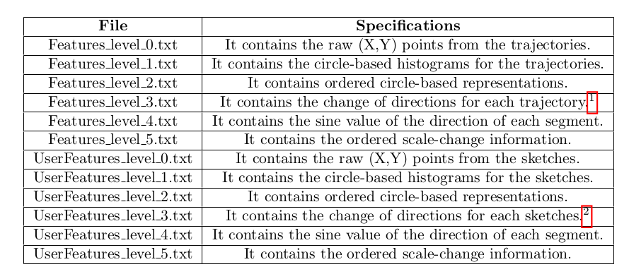

 
 # A Sketch Based Approach to Video Retrieval Using Qualitative Features
 ### Koustav Ghosal, Anoop Namboodiri
 ### ICVGIP, 2014

## Prerequisites
```
Python 2.7
Matplotlib
Numpy and Scipy
scikit-learn
Mlpy
```
## Data
### [IIIT Motion Dataset](https://drive.google.com/file/d/0B3Sw1UVAf8VKX2dZSGNCVGViRkk/view?usp=sharing)
It contains 2 folders PoolVideos and Synthetic. The Pool videos are divided into 9 classes and the Synthetic videos are divided into 5 classes as mentioned
in the paper.
## Trajectories
The Trajectories folder contains two sub-folders Pool and Synthetic, which contain the trajectories extracted from the Pool and Synthetic videos, respectively. The trajectories were extracted using functions available in the OpenCV Library and an open-source version of the Hungarian Algorithm. The trajectories from each video are stored in separate files and are provided in the following format —
``` Trajectory Index # Starting Frame # X_1 Y_1 X_2 Y_2 . . . X_n Y_n  ```

## User Input
The UserInput folder contains 2 sub-folders Pool and Synthetic each of which contain the online sketches collected from 25 different users. The data was collected using a Nexus tablet. Each user was shown 10 Pool and 10 Synthetic videos and then asked to sketch the most salient motions from the video which she/he could remember. Each file in Pool/Synthetic folder corresponds to one user containing all the trajectories from all the videos that she/he could remember. The data is stored in the following format —
``` Video Label # T_1 # T_2 # X_1 Y_1 P_1 X_2 Y_2 P_2 . . . X n Y n P n ```
where T_1 and T_2 are approximate starting and ending points of the trajectory as remembered by the user normalized to [0, 100]. (X, Y ) and P are the coordinates and pressure values for the sketch respectively.

## Features

This folder contains 2 sub-folders Pool and Synthetic, which contain the different sets of features described in the paper. In each file the features are stored in the following format. 
For Trajectories,  ``` Video Name # Trajectory Label # Starting Frame # Feature String ```
For User Sketches, ``` User Name # Video Label # Flag # Feature String ```
Please refer to our paper for a detailed description of the features.
## Running the scripts
The script RunRetrieval.py needs to be called from the terminal as
``` python RunRetrieval.py Path/To/Features ```
Replace ’Path To Features’ with ../Features/Pool/ or ../Features/Synthetic/, accordingly.
The code prints the Mean Reciprocal Rank at the terminal and displays three plots for Precision-Recall, Top-k Accuracy and histogram of reciprocal ranks.

## Contact
ghosalk@tcd.ie

## Bibtex
```
@article{ghosal2014sketch,
title={A Sketch-Based Approach To Video Retrieval Using Qualita-
tive Features},
author={Ghosal, Koustav and Namboodiri, Anoop},
year={2014}
}
```


